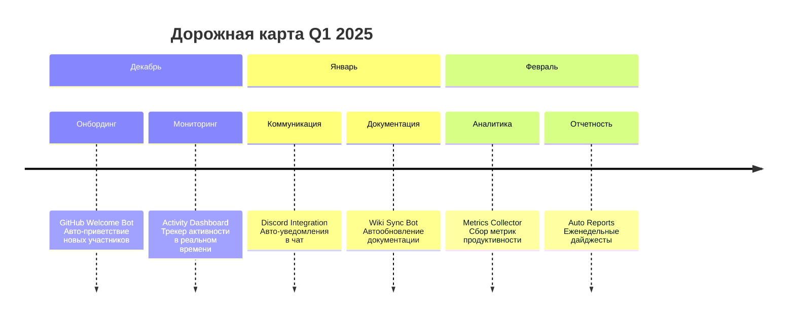

# 🚀 Top College | Наши проекты

Добро пожаловать на главную страницу нашей студенческой организации! Мы — сплоченная команда энтузиастов, желающих создавать проекты на стыке технологий и идей. Здесь вы можете познакомиться с каждым участником и посмотреть его резюме.

---

## 👥 Наша команда

Ниже представлены все участники нашей организации. Нажмите на кнопку с именем, чтобы перейти к подробному резюме.

<!-- Участник 1 -->

    
     
    <h3 style="margin-bottom: 8px;">500EFKA500</h3>
    
Full-Stack Разработчик

    <a href="500efka500_resume.md">
        <button style="background-color: #2d9bf0; color: white; border: none; padding: 10px 20px; border-radius: 25px; cursor: pointer; font-weight: bold; transition: all 0.3s ease;" onmouseover="this.style.backgroundColor='#1a73e8'" onmouseout="this.style.backgroundColor='#2d9bf0'">
            Резюме
        </button>
    </a>

<!-- Участник 2 -->

    
     
    <h3 style="margin-bottom: 8px;">Alex-hue-dfk</h3>
    
Data Scientist & AI

    <a href="emil.md">
        <button style="background-color: #e91e63; color: white; border: none; padding: 10px 20px; border-radius: 25px; cursor: pointer; font-weight: bold; transition: all 0.3s ease;" onmouseover="this.style.backgroundColor='#c2185b'" onmouseout="this.style.backgroundColor='#e91e63'">
            Резюме
        </button>
    </a>

<!-- Участник 3 -->

    
     
    <h3 style="margin-bottom: 8px;">Valeev Serj</h3>
    
DevOps & Cloud Engineer

    <a href="gabryelf_resume.html">
        <button style="background-color: #4caf50; color: white; border: none; padding: 10px 20px; border-radius: 25px; cursor: pointer; font-weight: bold; transition: all 0.3s ease;" onmouseover="this.style.backgroundColor='#388e3c'" onmouseout="this.style.backgroundColor='#4caf50'">
            Резюме
        </button>
    </a>

<!-- Участник 4 -->

    
     
    <h3 style="margin-bottom: 8px;">Goro</h3>
    
UX/UI Дизайнер

    <a href="sivash.md">
        <button style="background-color: #ff9800; color: white; border: none; padding: 10px 20px; border-radius: 25px; cursor: pointer; font-weight: bold; transition: all 0.3s ease;" onmouseover="this.style.backgroundColor='#f57c00'" onmouseout="this.style.backgroundColor='#ff9800'">
            Резюме
        </button>
    </a>

<!-- Участник 5 -->

    
     
    <h3 style="margin-bottom: 8px;">Hitsuga-K</h3>
    
Mobile Разработчик

    <a href="hitsuga_k_resume.md">
        <button style="background-color: #9c27b0; color: white; border: none; padding: 10px 20px; border-radius: 25px; cursor: pointer; font-weight: bold; transition: all 0.3s ease;" onmouseover="this.style.backgroundColor='#7b1fa2'" onmouseout="this.style.backgroundColor='#9c27b0'">
            Резюме
        </button>
    </a>

<!-- Участник 6 -->

    
     
    <h3 style="margin-bottom: 8px;">jpwein</h3>
    
Backend Разработчик

    <a href="jpwein_resume.md">
        <button style="background-color: #00bcd4; color: white; border: none; padding: 10px 20px; border-radius: 25px; cursor: pointer; font-weight: bold; transition: all 0.3s ease;" onmouseover="this.style.backgroundColor='#0097a7'" onmouseout="this.style.backgroundColor='#00bcd4'">
            Резюме
        </button>
    </a>

<!-- Участник 7 -->

    
     
    <h3 style="margin-bottom: 8px;">stupiqplonde</h3>
    
Frontend Разработчик

    <a href="stupiqplonde.md">
        <button style="background-color: #8bc34a; color: white; border: none; padding: 10px 20px; border-radius: 25px; cursor: pointer; font-weight: bold; transition: all 0.3s ease;" onmouseover="this.style.backgroundColor='#689f38'" onmouseout="this.style.backgroundColor='#8bc34a'">
            Резюме
        </button>
    </a>

---

## 📂 О наших проектах

# 🚀 **AUTOMATION HUB** | TopCollegeTCF

**Цифровой мозг нашей организации**  
*Где код становится процессом, а процесс — результатом*

---

## 🌟 **НАША ФИЛОСОФИЯ**

> Мы не просто пишем код — мы создаем **цифровую нервную систему** TopCollegeTCF.  
> Каждый скрипт — нейрон, каждый бот — орган, все вместе — живой организм.

## 🎯 **НАШИ ЦЕЛИ НА ЭТОТ КВАРТАЛ**

Хотите с нами сотрудничать или узнать больше? Пишите!

## 📬 Контакты организации

*   **GitHub Организации:** [https://github.com/top-college](https://github.com/TopCollegeTCF)
*   **Email:** gabryelf@yandex.ru

---
Страница создана с ❤️ силами нашей команды и GitHub Pages.
