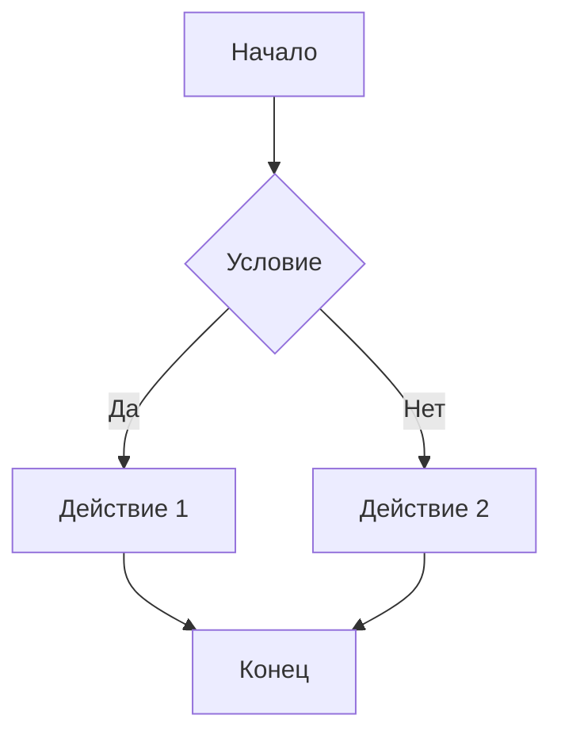
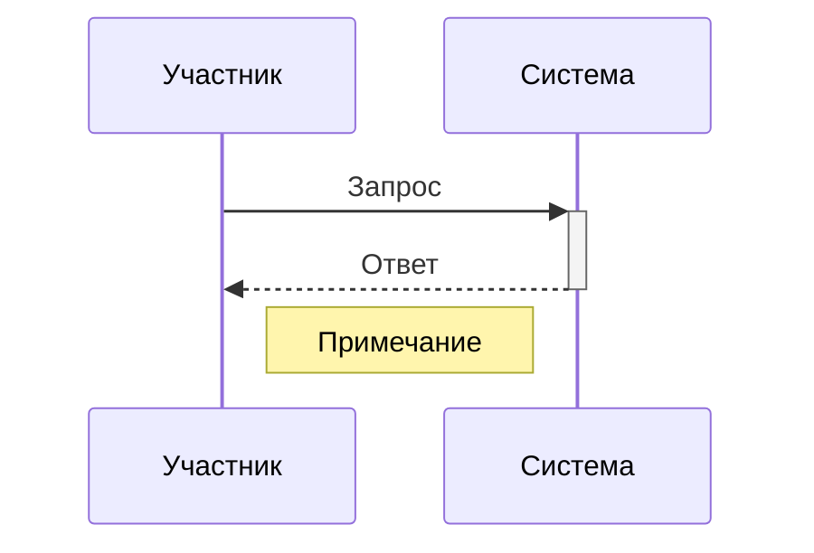
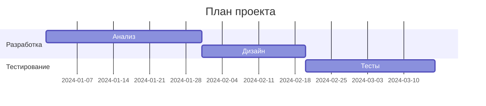
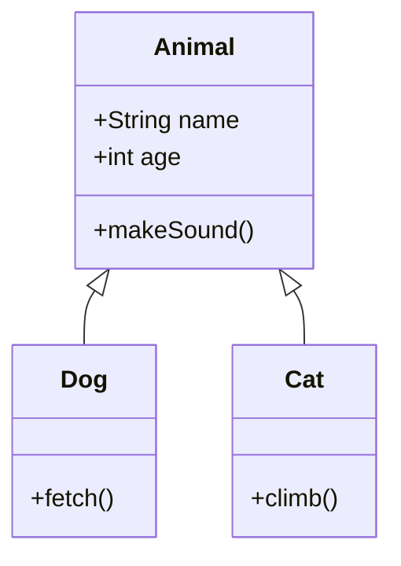
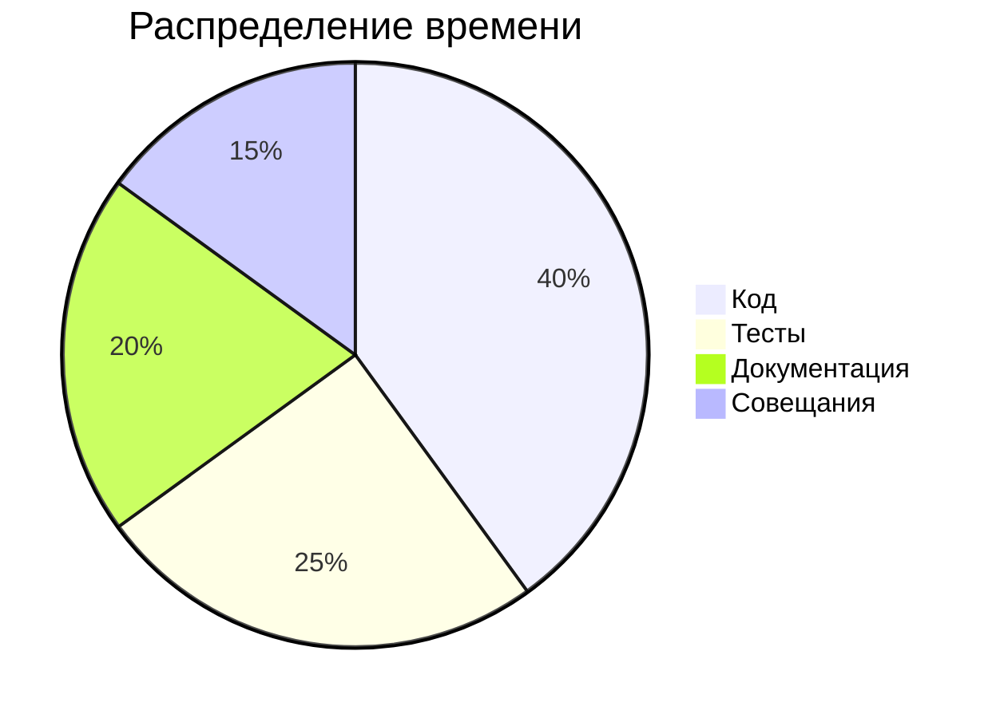

# 🎨 Полная шпаргалка по Markdown

## 📋 Содержание
1. [Базовый синтаксис](#-базовый-синтаксис)
2. [Расширенное форматирование](#-расширенное-форматирование)
3. [Списки всех типов](#-списки-всех-типов)
4. [Таблицы и выравнивание](#-таблицы-и-выравнивание)
5. [Код и синтаксис](#-код-и-синтаксис)
6. [Ссылки и изображения](#-ссылки-и-изображения)
7. [HTML в Markdown](#-html-в-markdown)
8. [Расширения GFM](#-расширения-gfm)
9. [Математические формулы](#-математические-формулы)
10. [Диаграммы Mermaid](#-диаграммы-mermaid)
11. [Emoji и символы](#-emoji-и-символы)
12. [Скрытый контент](#-скрытый-контент)
13. [Производительность](#-производительность)

---

## 📖 Базовый синтаксис

### Заголовки
```markdown
# Заголовок 1 уровня
## Заголовок 2 уровня
### Заголовок 3 уровня
#### Заголовок 4 уровня
##### Заголовок 5 уровня
###### Заголовок 6 уровня
```

# Заголовок 1 уровня
## Заголовок 2 уровня
### Заголовок 3 уровня
#### Заголовок 4 уровня
##### Заголовок 5 уровня
###### Заголовок 6 уровня

### Альтернативный синтаксис для h1 и h2
```markdown
Заголовок 1 уровня
==================

Заголовок 2 уровня
------------------
```

Заголовок 1 уровня
==================

Заголовок 2 уровня
------------------

### Жирный текст
```markdown
**жирный текст**
__жирный текст__
```

**жирный текст**
__жирный текст__

### Курсив
```markdown
*курсивный текст*
_курсивный текст_
```

*курсивный текст*
_курсивный текст_

### Жирный курсив
```markdown
***жирный курсив***
___жирный курсив___
**_жирный курсив_**
__*жирный курсив*__
```

***жирный курсив***
___жирный курсив___
**_жирный курсив_**
__*жирный курсив*__

### Зачеркнутый текст
```markdown
~~зачеркнутый текст~~
```

~~зачеркнутый текст~~

### Подчеркнутый текст (через HTML)
```markdown
<u>подчеркнутый текст</u>
```

<u>подчеркнутый текст</u>

### Выделение маркером (через HTML)
```markdown
<mark>выделенный текст</mark>
```

<mark>выделенный текст</mark>

---

## 📝 Расширенное форматирование

### Комбинированное форматирование
```markdown
**Жирный с _курсивом внутри_** и ~~зачеркнутый с *курсивом*~~
```

**Жирный с _курсивом внутри_** и ~~зачеркнутый с *курсивом*~~

### Инлайн-цитаты
```markdown
Он сказал: `это код в строке` и продолжил.
```

Он сказал: `это код в строке` и продолжил.

### Верхний и нижний индексы (HTML)
```markdown
H<sub>2</sub>O и E=mc<sup>2</sup>
```

H<sub>2</sub>O и E=mc<sup>2</sup>

### Маленький текст (HTML)
```markdown
<small>мелкий текст для примечаний</small>
```

<small>мелкий текст для примечаний</small>

### Аббревиатуры (HTML)
```markdown
<abbr title="HyperText Markup Language">HTML</abbr>
```

<abbr title="HyperText Markup Language">HTML</abbr>

### Время (HTML)
```markdown
Встречаемся <time datetime="2024-12-14">14 декабря</time>
```

Встречаемся <time datetime="2024-12-14">14 декабря</time>

---

## 📋 Списки всех типов

### Неупорядоченные списки
```markdown
- Пункт 1
- Пункт 2
  - Подпункт 2.1
  - Подпункт 2.2
    - Подподпункт 2.2.1
- Пункт 3

* Альтернативный маркер
+ Еще один вариант
```

- Пункт 1
- Пункт 2
  - Подпункт 2.1
  - Подпункт 2.2
    - Подподпункт 2.2.1
- Пункт 3

* Альтернативный маркер
+ Еще один вариант

### Упорядоченные списки
```markdown
1. Первый пункт
2. Второй пункт
   1. Подпункт 2.1
   2. Подпункт 2.2
3. Третий пункт

1. Можно начать с любого числа
5. Система сама пронумерует
9. Это удобно для редактирования
```

1. Первый пункт
2. Второй пункт
   1. Подпункт 2.1
   2. Подпункт 2.2
3. Третий пункт

1. Можно начать с любого числа
5. Система сама пронумерует
9. Это удобно для редактирования

### Список задач
```markdown
- [x] Выполненная задача
- [ ] Незавершенная задача
- [ ] Еще одна задача
  - [x] Вложенная выполненная
  - [ ] Вложенная невыполненная
```

- [x] Выполненная задача
- [ ] Незавершенная задача
- [ ] Еще одна задача
  - [x] Вложенная выполненная
  - [ ] Вложенная невыполненная

### Смешанные списки
```markdown
1. Первый пункт
   - Подпункт
   * Еще подпункт
2. Второй пункт
   - [x] Задача
   - [ ] Задача
```

1. Первый пункт
   - Подпункт
   * Еще подпункт
2. Второй пункт
   - [x] Задача
   - [ ] Задача

### Определения
```markdown
Термин 1
: Определение первого термина

Термин 2
: Определение второго термина
  Может быть многострочным
: Альтернативное определение
```

Термин 1
: Определение первого термина

Термин 2
: Определение второго термина
  Может быть многострочным
: Альтернативное определение

---

## 📊 Таблицы и выравнивание

### Базовая таблица
```markdown
| Заголовок 1 | Заголовок 2 | Заголовок 3 |
|-------------|-------------|-------------|
| Ячейка 1    | Ячейка 2    | Ячейка 3    |
| Ячейка 4    | Ячейка 5    | Ячейка 6    |
```

| Заголовок 1 | Заголовок 2 | Заголовок 3 |
|-------------|-------------|-------------|
| Ячейка 1    | Ячейка 2    | Ячейка 3    |
| Ячейка 4    | Ячейка 5    | Ячейка 6    |

### Выравнивание столбцов
```markdown
| По левому краю | По центру | По правому краю | По умолчанию |
|:---------------|:---------:|----------------:|--------------|
| Текст          | Текст     |            Текст | Текст        |
| Еще текст      | Еще текст |        Еще текст | Еще текст    |
```

| По левому краю | По центру | По правому краю | По умолчанию |
|:---------------|:---------:|----------------:|--------------|
| Текст          | Текст     |            Текст | Текст        |
| Еще текст      | Еще текст |        Еще текст | Еще текст    |

### Таблица с форматированием
```markdown
| Название | Цена | Наличие | Рейтинг |
|----------|------|---------|---------|
| Товар A  | **999** ₽ | ✅ В наличии | ⭐⭐⭐⭐⭐ |
| Товар B  | ~~1500~~ **1299** ₽ | ⚠️ Мало | ⭐⭐⭐⭐☆ |
| Товар C  | 499 ₽ | ❌ Нет | ⭐⭐⭐☆☆ |
```

| Название | Цена | Наличие | Рейтинг |
|----------|------|---------|---------|
| Товар A  | **999** ₽ | ✅ В наличии | ⭐⭐⭐⭐⭐ |
| Товар B  | ~~1500~~ **1299** ₽ | ⚠️ Мало | ⭐⭐⭐⭐☆ |
| Товар C  | 499 ₽ | ❌ Нет | ⭐⭐⭐☆☆ |

### Компактная запись таблицы
```markdown
Заголовок 1 | Заголовок 2 | Заголовок 3
-|-|-
Ячейка 1 | Ячейка 2 | Ячейка 3
Ячейка 4 | Ячейка 5 | Ячейка 6
```

Заголовок 1 | Заголовок 2 | Заголовок 3
-|-|-
Ячейка 1 | Ячейка 2 | Ячейка 3
Ячейка 4 | Ячейка 5 | Ячейка 6

---

## 💻 Код и синтаксис

### Код в строке
```markdown
Используйте `console.log()` для вывода.
```

Используйте `console.log()` для вывода.

### Блок кода без подсветки
````markdown
```
function hello() {
  console.log("Hello World!");
}
```
````

```
function hello() {
  console.log("Hello World!");
}
```

### Блок кода с указанием языка
````markdown
```javascript
function greet(name) {
  return `Hello, ${name}!`;
}
```
````

```javascript
function greet(name) {
  return `Hello, ${name}!`;
}
```

### Несколько популярных языков
````markdown
```python
def factorial(n):
    return 1 if n == 0 else n * factorial(n-1)
```

```html
<div class="container">
  <h1>Hello World</h1>
</div>
```

```css
.container {
  padding: 20px;
  background: #f0f0f0;
}
```

```bash
git add .
git commit -m "Сообщение"
git push
```

```json
{
  "name": "Project",
  "version": "1.0.0",
  "dependencies": {}
}
```
````

```python
def factorial(n):
    return 1 if n == 0 else n * factorial(n-1)
```

```html
<div class="container">
  <h1>Hello World</h1>
</div>
```

```css
.container {
  padding: 20px;
  background: #f0f0f0;
}
```

```bash
git add .
git commit -m "Сообщение"
git push
```

```json
{
  "name": "Project",
  "version": "1.0.0",
  "dependencies": {}
}
```

### Диффы (различия в коде)
````markdown
```diff
- Удаленная строка
+ Добавленная строка
! Измененная строка
# Комментарий
```
````

```diff
- Удаленная строка
+ Добавленная строка
! Измененная строка
# Комментарий
```

### Вложенные блоки кода
````markdown
```
Внешний блок кода с ```внутренним блоком```
```
````

```
Внешний блок кода с ```внутренним блоком```
```

---

## 🔗 Ссылки и изображения

### Простая ссылка
```markdown
https://github.com
```

https://github.com

### Ссылка с текстом
```markdown
[Текст ссылки](https://example.com)
```

[Текст ссылки](https://example.com)

### Ссылка с подсказкой
```markdown
[Наведите курсор](https://example.com "Всплывающая подсказка")
```

[Наведите курсор](https://example.com "Всплывающая подсказка")

### Ссылка на заголовок внутри документа
```markdown
[Вернуться к содержанию](#содержание)
```

[Вернуться к содержанию](#содержание)

### Ссылка-сноска
```markdown
Это текст со ссылкой[^1].

[^1]: Это определение сноски.
```

Это текст со ссылкой[^1].

[^1]: Это определение сноски.

### Несколько сносок
```markdown
Первая ссылка[^1], вторая[^2], третья[^ref].

[^1]: Первая сноска.
[^2]: Вторая сноска.
[^ref]: Сноска с произвольным идентификатором.
```

Первая ссылка[^2], вторая[^3], третья[^ref].

[^2]: Первая сноска.
[^3]: Вторая сноска.
[^ref]: Сноска с произвольным идентификатором.

### Изображение
```markdown

```


### Изображение с ссылкой
```markdown
[](https://github.com)
```

[](https://github.com)

### Изображение с размерами (HTML)
```markdown

```


### Ссылка-якорь (HTML)
```markdown
<a name="секция"></a>
## Секция
```

<a name="секция"></a>
## Секция

---

## 🏗️ HTML в Markdown

### Разрыв строки
```markdown
Первая строка<br>Вторая строка
```

Первая строка<br>Вторая строка

### Горизонтальная линия
```markdown
***
---
___
<hr>
```

***
---
___
<hr>

### Детали/аккордеон (HTML5)
```markdown
<details>
<summary>Нажмите, чтобы развернуть</summary>

Содержимое внутри блока.

```python
print("Hello")
```

</details>
```

<details>
<summary>Нажмите, чтобы развернуть</summary>

Содержимое внутри блока.

```python
print("Hello")
```

</details>

### Аккордеон с маркдауном внутри
```markdown
<details>
<summary><strong>📁 Папка с файлами</strong></summary>

- `index.html`
- `style.css`
- `script.js`

> Примечание внутри аккордеона
</details>
```

<details>
<summary><strong>📁 Папка с файлами</strong></summary>

- `index.html`
- `style.css`
- `script.js`

> Примечание внутри аккордеона
</details>

### Цитата внутри HTML
```markdown
<div style="border-left: 4px solid #ccc; padding-left: 20px; margin: 20px 0;">
> Это цитата внутри HTML блока
> Она будет отформатирована как обычная цитата
</div>
```

<div style="border-left: 4px solid #ccc; padding-left: 20px; margin: 20px 0;">
> Это цитата внутри HTML блока
> Она будет отформатирована как обычная цитата
</div>

### Кастомные стили
```markdown
<p style="color: #ff6b6b; background: #ffeaa7; padding: 10px; border-radius: 5px;">
🎨 Текст с кастомными стилями
</p>
```

<p style="color: #ff6b6b; background: #ffeaa7; padding: 10px; border-radius: 5px;">
🎨 Текст с кастомными стилями
</p>

### Центрирование
```markdown
<center>
<h3>Центрированный заголовок</h3>
<p>И параграф тоже по центру</p>
</center>
```

<center>
<h3>Центрированный заголовок</h3>
<p>И параграф тоже по центру</p>
</center>

---

## 🎭 Расширения GFM (GitHub Flavored Markdown)

### Цитаты (блоки)
```markdown
> Это простая цитата.
> Она может занимать несколько строк.
>
> > Вложенная цитата.
> 
> И продолжение основной цитаты.
```

> Это простая цитата.
> Она может занимать несколько строк.
>
> > Вложенная цитата.
> 
> И продолжение основной цитаты.

### Цитата с форматированием
```markdown
> ### Цитата с заголовком
> 
> - Список внутри цитаты
> - Еще один пункт
> 
> `Код внутри цитаты`
> 
> **Жирный текст** и *курсив*
```

> ### Цитата с заголовком
> 
> - Список внутри цитаты
> - Еще один пункт
> 
> `Код внутри цитаты`
> 
> **Жирный текст** и *курсив*

### Автоматические ссылки
```markdown
<https://github.com>
<email@example.com>
```

<https://github.com>
<email@example.com>

### Зачеркивание таблиц
```markdown
| ~~Старая цена~~ | **Новая цена** |
|-----------------|----------------|
| ~~1000~~        | **800**        |
```

| ~~Старая цена~~ | **Новая цена** |
|-----------------|----------------|
| ~~1000~~        | **800**        |

### Игнорирование Markdown
```markdown
Здесь \*звездочки\* не станут курсивом.
```

Здесь \*звездочки\* не станут курсивом.

---

## 🔢 Математические формулы

### Встроенные формулы
```markdown
Вот формула: $E = mc^2$
```

Вот формула: $E = mc^2$

### Блочные формулы
```markdown
$$
\int_{-\infty}^{\infty} e^{-x^2} dx = \sqrt{\pi}
$$
```

$$
\int_{-\infty}^{\infty} e^{-x^2} dx = \sqrt{\pi}
$$

### Комплексные формулы
```markdown
$$
\begin{aligned}
f(x) &= \frac{1}{\sigma\sqrt{2\pi}} e^{-\frac{1}{2}\left(\frac{x-\mu}{\sigma}\right)^2} \\
\sum_{i=1}^{n} i &= \frac{n(n+1)}{2}
\end{aligned}
$$
```

$$
\begin{aligned}
f(x) &= \frac{1}{\sigma\sqrt{2\pi}} e^{-\frac{1}{2}\left(\frac{x-\mu}{\sigma}\right)^2} \\
\sum_{i=1}^{n} i &= \frac{n(n+1)}{2}
\end{aligned}
$$

### Матрицы
```markdown
$$
\begin{bmatrix}
1 & 2 & 3 \\
4 & 5 & 6 \\
7 & 8 & 9
\end{bmatrix}
$$
```

$$
\begin{bmatrix}
1 & 2 & 3 \\
4 & 5 & 6 \\
7 & 8 & 9
\end{bmatrix}
$$

---

## 📈 Диаграммы Mermaid

### Блок-схема
````markdown

````


### Последовательность
````markdown

````


### Гант-диаграмма
````markdown

````


### Класс-диаграмма
````markdown

````


### Круговой график
````markdown

````


---

## 😊 Emoji и символы

### Прямые emoji
```markdown
🚀 ✨ ⭐ 🎯 ✅ ❌ ⚠️ ℹ️ 🔥 💡 🛠️ 📚
```

🚀 ✨ ⭐ 🎯 ✅ ❌ ⚠️ ℹ️ 🔥 💡 🛠️ 📚

### Emoji коды
```markdown
:rocket: :sparkles: :star: :dart: :white_check_mark: :x:
```

:rocket: :sparkles: :star: :dart: :white_check_mark: :x:

### Специальные символы
```markdown
→ ← ↑ ↓ ↔ ↕ ⇄ ⇅ © ® ™ ° ± × ÷ ≠ ≈ ≤ ≥ ∞
```

→ ← ↑ ↓ ↔ ↕ ⇄ ⇅ © ® ™ ° ± × ÷ ≠ ≈ ≤ ≥ ∞

### Математические символы
```markdown
α β γ δ ε ζ η θ ι κ λ μ ν ξ ο π ρ σ τ υ φ χ ψ ω
Α Β Γ Δ Ε Ζ Η Θ Ι Κ Λ Μ Ν Ξ Ο Π Ρ Σ Τ Υ Φ Χ Ψ Ω
∂ ∇ ∏ ∑ √ ∛ ∜ ∫ ∬ ∭ ∮ ∯ ∰
```

α β γ δ ε ζ η θ ι κ λ μ ν ξ ο π ρ σ τ υ φ χ ψ ω
Α Β Γ Δ Ε Ζ Η Θ Ι Κ Λ Μ Ν Ξ Ο Π Ρ Σ Τ Υ Φ Χ Ψ Ω
∂ ∇ ∏ ∑ √ ∛ ∜ ∫ ∬ ∭ ∮ ∯ ∰

### Дроби (HTML)
```markdown
½ ⅓ ¼ ⅕ ⅙ ⅛ ⅔ ¾ ⅖ ⅗ ⅘ ⅚ ⅜ ⅝ ⅞
```

½ ⅓ ¼ ⅕ ⅙ ⅛ ⅔ ¾ ⅖ ⅗ ⅘ ⅚ ⅜ ⅝ ⅞

### Шахматные фигуры
```markdown
♔ ♕ ♖ ♗ ♘ ♙ ♚ ♛ ♜ ♝ ♞ ♟
```

♔ ♕ ♖ ♗ ♘ ♙ ♚ ♛ ♜ ♝ ♞ ♟

---

## 🎪 Скрытый контент

### Комментарии (невидимые)
```markdown
[//]: # (Это комментарий, который не увидит читатель)
<!-- Это тоже комментарий -->
```

[//]: # (Это комментарий, который не увидит читатель)
<!-- Это тоже комментарий -->

### Скрытый текст с пробелами
```markdown
Нормальный текст<!-- скрытый текст -->продолжение
```

Нормальный текст<!-- скрытый текст -->продолжение

### Условные комментарии
```markdown
<!-- markdownlint-disable MD033 -->
<div>HTML без предупреждений</div>
<!-- markdownlint-restore -->
```

<!-- markdownlint-disable MD033 -->
<div>HTML без предупреждений</div>
<!-- markdownlint-restore -->

---

## ⚡ Производительность

### Минификация ссылок
```markdown
[Google][1] и [GitHub][2]

[1]: https://google.com
[2]: https://github.com
```

[Google][1] и [GitHub][2]

[1]: https://google.com
[2]: https://github.com

### Группировка сносок
```markdown
Используйте [Git][git-link] для контроля версий.
Смотрите [документацию][docs].

[git-link]: https://git-scm.com
[docs]: https://git-scm.com/doc
```

Используйте [Git][git-link] для контроля версий.
Смотрите [документацию][docs].

[git-link]: https://git-scm.com
[docs]: https://git-scm.com/doc

### Автоматические ссылки-якоря
```markdown
## Раздел 1
Содержимое...

## Раздел 2  
Содержимое...
```

## Раздел 1
Содержимое...

## Раздел 2  
Содержимое...

---

## 🎁 Бонус: Продвинутые техники

### Таблица с переносами строк
```markdown
| Функция | Описание |
|---------|----------|
| `trim()` | Удаляет пробелы с обоих концов<br>Возвращает новую строку |
| `slice()` | Извлекает часть строки<br>Не изменяет оригинал |
```

| Функция | Описание |
|---------|----------|
| `trim()` | Удаляет пробелы с обоих концов<br>Возвращает новую строку |
| `slice()` | Извлекает часть строки<br>Не изменяет оригинал |

### Колонки через HTML
```markdown
<div style="display: grid; grid-template-columns: 1fr 1fr; gap: 20px;">
<div>

## Левая колонка
- Пункт 1
- Пункт 2

</div>
<div>

## Правая колонка
1. Первый
2. Второй

</div>
</div>
```

<div style="display: grid; grid-template-columns: 1fr 1fr; gap: 20px;">
<div>

## Левая колонка
- Пункт 1
- Пункт 2

</div>
<div>

## Правая колонка
1. Первый
2. Второй

</div>
</div>

### Анимация (ограниченная поддержка)
```markdown
<p style="animation: pulse 2s infinite;">
✨ Мигающий текст ✨
</p>

<style>
@keyframes pulse {
  0% { opacity: 1; }
  50% { opacity: 0.5; }
  100% { opacity: 1; }
}
</style>
```

<p style="animation: pulse 2s infinite;">
✨ Мигающий текст ✨
</p>

<style>
@keyframes pulse {
  0% { opacity: 1; }
  50% { opacity: 0.5; }
  100% { opacity: 1; }
}
</style>

### Интерактивные элементы
```markdown
<button onclick="alert('Привет!')">Нажми меня</button>

<input type="range" min="1" max="100" value="50">
```

<button onclick="alert('Привет!')">Нажми меня</button>

<input type="range" min="1" max="100" value="50">

### Кастомные идентификаторы для заголовков
```markdown
### Заголовок {#custom-id}
```

### Заголовок {#custom-id}

---

## 📌 Итоговая таблица всех элементов

| Элемент | Синтаксис | Пример |
|---------|-----------|--------|
| Заголовок 1 | `# Текст` | # Заголовок 1 |
| Заголовок 2 | `## Текст` | ## Заголовок 2 |
| Жирный | `**Текст**` | **Текст** |
| Курсив | `*Текст*` | *Текст* |
| Зачеркнутый | `~~Текст~~` | ~~Текст~~ |
| Ссылка | `[Текст](URL)` | [GitHub](https://github.com) |
| Изображение | `` |  |
| Код в строке | `` `Код` `` | `print()` |
| Блок кода | ` ```язык\nкод\n``` ` | ```python<br>print()<br>``` |
| Список | `- Пункт` | • Пункт |
| Нумерованный | `1. Пункт` | 1. Пункт |
| Задача | `- [x] Задача` | ✓ Задача |
| Таблица | `\|Заг\|`<br>`\|--\|` | | Заголовок |
| Цитата | `> Текст` | > Текст |
| Формула | `$E=mc^2$` | $E=mc^2$ |
| Горизонтальная | `---` | --- |
| Сноска | `[^1]` и `[^1]:` | [^1] |

---

## 🎯 Практический совет

> **💡 Профессиональный совет:** Используйте эту шпаргалку как справочник. Для реальных проектов создавайте собственные шаблоны и стилистические руководства. Сочетайте Markdown с HTML для максимальной гибкости, но помните о переносимости — не все рендереры поддерживают расширенные функции.

---
*Шпаргалка обновлена: Декабрь 2025*
*Поддерживается в GitHub, GitLab, VS Code и большинстве современных редакторов*

[⬆ Вернуться к началу](#-полная-шпаргалка-по-markdown)
